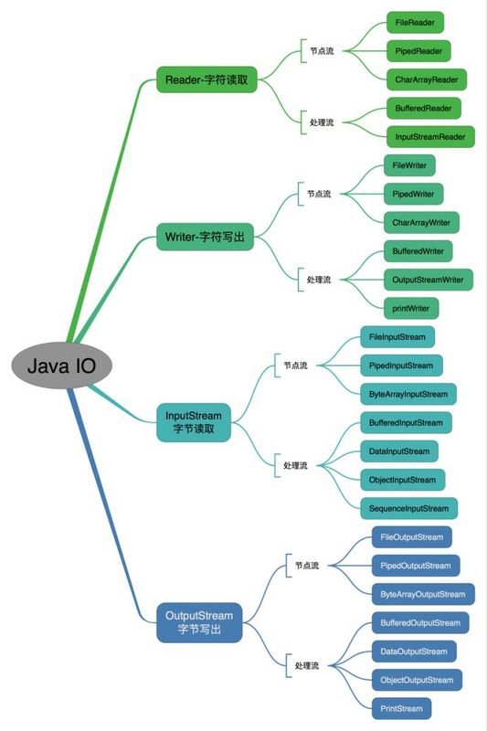
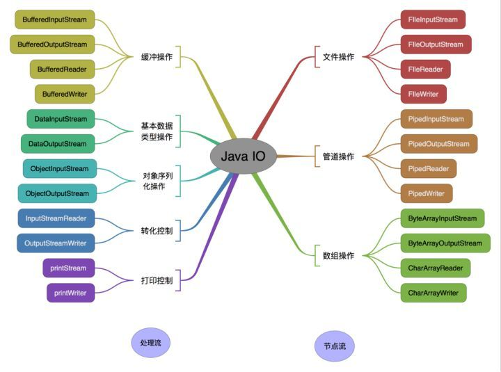
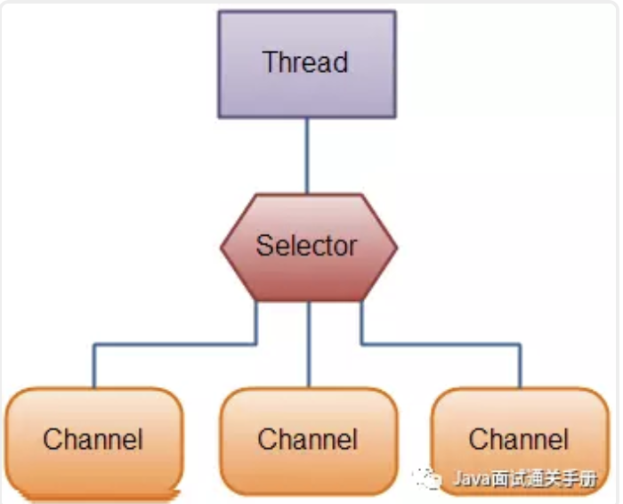
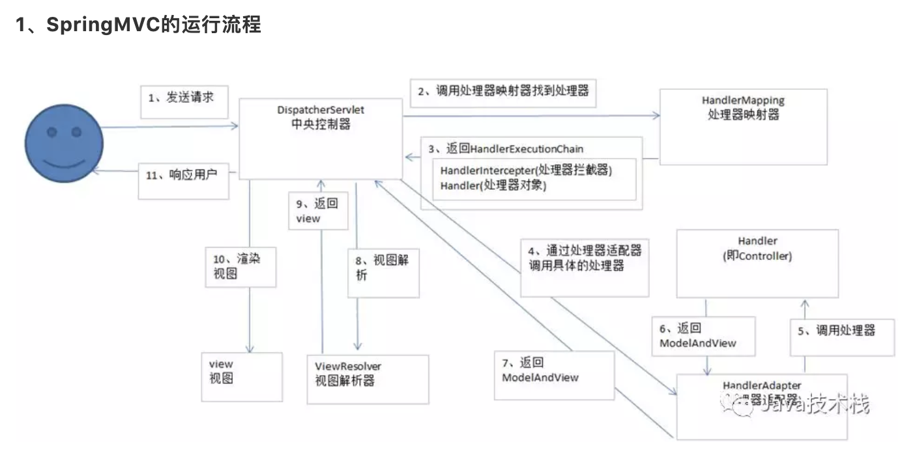
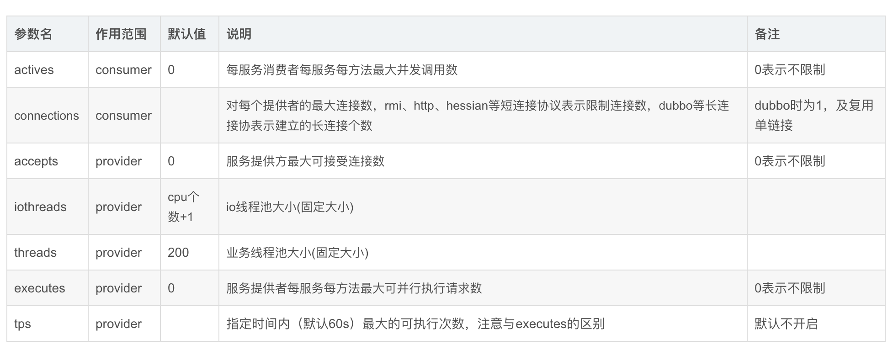
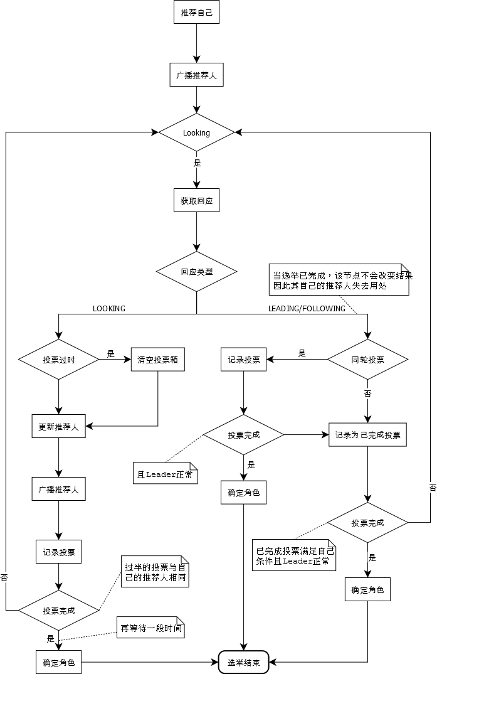
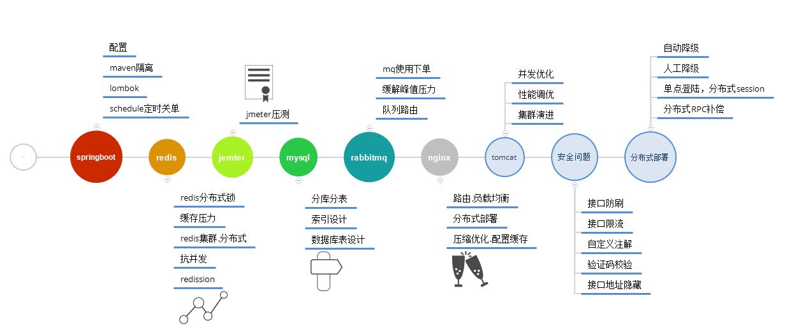

##面试准备

1. 个人介绍，需要准备1分钟和5分钟两个版本，包括学习经历、工作经历、项目经历、个人优势、一句话总结。一定要自己背得滚瓜烂熟，张口就来

2. 抽象概念回答方式，当面试官问你是如何理解多线程的时候，你要知道从定义、来源、实现、问题、优化、应用方面系统性地回答

3. 项目所占的比重是非常大的，至少与知识点的比例是五五开，所以必须针对简历中的两个以上的项目，形成包括【架构和实现细节】，【正常流程和异常流程的处理】，【难点+坑+复盘优化】三位一体的组合拳

4. 压力练习，面试的时候难免紧张，可能会严重影响发挥，通过平时多找机会参与交流分享，或找人做压力面试来改善

5. 表达练习，表达能力非常影响在面试中的表现，能否简练地将答案告诉面试官，可以通过给自己讲解的方式刻意练习

### JAVA 基础

---

#### 封装

* 封装的定义：
  - 首先是抽象，把事物抽象成一个类，其次才是封装，将事物拥有的属性和动作隐藏起来，只保留特定的方法与外界联系
* 为什么需要封装：
  - 封装符合面向对象设计原则的第一条：单一性原则，一个类把自己该做的事情封装起来，而不是暴露给其他类去处理，当内部的逻辑发生变化时，外部调用不用因此而修改，他们只调用开放的接口，而不用去关心内部的实现

#### 继承

* Java的类可以分为三类：
  * 类：使用class定义，没有抽象方法
  * 抽象类：使用abstract class定义，可以有也可以没有抽象方法
  * 接口：使用inerface定义，只能有抽象方法

* 在这三个类型之间存在如下关系：
  * 类可以extends：类、抽象类（必须实现所有抽象方法），但只能extends一个，可以implements多个接口（必须实现所有接口方法）
  * 抽象类可以extends：类，抽象类（可全部、部分、或者完全不实现父类抽象方法），可以implements多个接口（可全部、部分、或者完全不实现接口方法）
  * 接口能extends多个接口（//这里原博主中有错误，已经修正）

* 继承以后子类可以得到什么：
  * 子类拥有父类非private的属性和方法（//这里其实我是持怀疑态度，之前听到过一种说法，子类继承了父类所有的成员，也包括private修饰的，只是 不能够调用罢了，如果有人知道，欢迎留言讨论）
  * 子类可以添加自己的方法和属性，即对父类进行扩展
  * 子类可以重新定义父类的方法，即多态里面的覆盖，后面会详述

* 关于构造函数：
  * 构造函数不能被继承，子类可以通过super()显示调用父类的构造函数
  * 创建子类时，编译器会自动调用父类的 无参构造函数
  * **如果父类没有定义无参构造函数，子类必须在构造函数的第一行代码使用super()显示调用**

* 为什么需要继承：

  - 代码重用是一点，最重要的还是所谓想上转型，即父类的引用变量可以指向子类对象，这是Java面向对象最重要特性多态的基础

* 继承代码执行顺序

  ```java
  //父类
  public class Father {
      static {
          System.out.println("父类静态代码块");  //①
      }
    
      {
          System.out.println("父类普通代码块");	//③
      }
    
      public Father() {
          System.out.println("父类构造函数");		//④
      }
  }	
  
  //子类
  public class Son extends Father {
      static {
          System.out.println("子类静态代码块");	//②
      }
    
      {
          System.out.println("子类普通代码块");	//⑤
      }
  
      public Son() {
          System.out.println("子类构造方法");		//⑥
      }
    
      @Override
      protected void finalize() throws Throwable {
          System.out.println("回收！");				//⑦
          super.finalize();
      }
  }
  
  //测试继承子类构造函数时，父类子类的调用顺序
  public class Test {
      public static void main(String[] args) {
          Father son = new Son();
          son = null;
          System.gc();
      }
  }
  
  //控制台输出
  父类静态代码块
  子类静态代码块
  父类普通代码块
  父类构造函数
  子类普通代码块
  子类构造方法
  回收！
  ```

#### 多态

* 在了解多态之前，首先需要知道方法的唯一性标识即什么是相同/不同的方法：
  * 一个方法可以由：修饰符如public、static+返回值+方法名+参数+throw的异常 5部分构成
  * 其中只有方法名和参数是唯一性标识，意即只要方法名和参数相同那他们就是相同的方法
  * 所谓参数相同，是指参数的个数，类型，顺序一致，其中任何一项不同都是不同的方法

* 何谓重载：
  * 重载是指一个类里面（包括父类的方法）存在方法名相同，但是参数不一样的方法，参数不一样可以是不同的参数个数、类型或顺序
  * 如果仅仅是修饰符、返回值、throw的异常 不同，那这是2个相同的方法，编译都通不过，更不要说重载了

* 何谓覆盖/重写：

  - 覆盖描述存在继承关系时子类的一种行为
  - 子类中存在和父类相同的方法即为覆盖，何谓相同方法请牢记前面的描述，方法名和参数相同，包括参数个数、类型、顺序

* 覆盖/重写的规则：（两同两小一大原则）

  - 子类不能覆盖父类private的方法，private对子类不可见，如果子类定义了一个和父类private方法相同的方法，实为新增方法
  - 重写方法的修饰符一定要大于等于被重写方法的修饰符(public > protected > default > private)
  - 重写抛出的异常需与父类相同或是父类异常的子类，或者重写方法干脆不写throws
  - 重写方法的返回值必须与被重写方法一致，否则编译报错
  - 静态方法不能被重写为非静态方法，否则编译出错

* 理解了上述知识点，是时候定义多态了：

  - 多态可以说是“一个接口，多种实现”或者说是父类的引用变量可以指向子类的实例，被引用对象的类型决定调用谁的方法，但这个方法必须在父类中定义
  - 多态可以分为两种类型：编译时多态（方法的重载）和运行时多态（继承时方法的重写），编译时多态很好理解，后述内容针对运行时多态
  - 运行时多态依赖于继承、重写和向上转型

  ```java
  class Human {
   
      public void fun1() {
          System.out.println("Human fun1");
          fun2();
      }
   
      public void fun2() {
          System.out.println("Human fun2");
      }
  }
   
  class Programmer extends Human {
   		//方法重载
      public void fun1(String name) {
          System.out.println("Programmer's fun1");
      }
   
      public void fun2() {
          System.out.println("Programmer's fun2");
      }
  }
   
  public class Test {
      public static void main(String[] args) {
          Human human = new Programmer();
          human.fun1();	//调用无参数函数，使用父类，Fun2使用子类
      }
      /*
       * Output:
       *  Human fun1
       *  Programmer's fun2
       */
  }
  ```

  ```java
  public class A {    
      public int a = 0;
      public void fun(){
          System.out.println("-----A-----");
      }
  }
   
  public class B extends A{
      public int a = 1;
      public void fun(){
          System.out.println("-----B-----");
      }
   
  public static void main(String[] args){
          A classA = new B();     
          System.out.println(classA.a);
          classA.fun();
      }   
  }
  
  //output
  //0
  //-----B-----
  
  //注意：
  //java中变量不能重写，可以按如下口诀记忆：
  >	变量多态看左边， 
  > 方法多态看右边， 
  > 静态多态看左边。
  ```

#### 抽象类

​	在了解抽象类之前，先来了解一下抽象方法。抽象方法是一种特殊的方法：它只有声明，而没有具体的实现。抽象方法的声明格式为：

```java
abstract
void  fun();
```

​	抽象方法必须用abstract关键字进行修饰。如果一个类含有抽象方法，则称这个类为抽象类，抽象类必须在类前用abstract关键字修饰。因为抽象类中含有无具体实现的方法，所以不能用抽象类创建对象。

​	抽象类就是为了继承而存在的，如果你定义了一个抽象类，却不去继承它，那么等于白白创建了这个抽象类，因为你不能用它来做任何事情。对于一个父类，如果它的某个方法在父类中实现出来没有任何意义，必须根据子类的实际需求来进行不同的实现，那么就可以将这个方法声明为abstract方法，此时这个类也就成为abstract类了。

​	包含抽象方法的类称为抽象类，但并不意味着抽象类中只能有抽象方法，它和普通类一样，同样可以拥有成员变量和普通的成员方法。注意，抽象类和普通类的主要有三点区别：

1）抽象方法必须为public或者protected（因为如果为private，则不能被子类继承，子类便无法实现该方法），缺省情况下默认为public。

2）抽象类不能用来创建对象；

3）如果一个类继承于一个抽象类，则子类必须实现父类的抽象方法。如果子类没有实现父类的抽象方法，则必须将子类也定义为为abstract类。

#### 接口

​	接口中可以含有 变量和方法。但是要注意，接口中的变量会被隐式地指定为public static final变量（并且只能是public static final变量，用private修饰会报编译错误），而方法会被隐式地指定为public abstract方法且只能是public abstract方法（用其他关键字，比如private、protected、static、 final等修饰会报编译错误），并且接口中所有的方法不能有具体的实现，也就是说，接口中的方法必须都是抽象方法。从这里可以隐约看出接口和抽象类的区别，接口是一种极度抽象的类型，它比抽象类更加“抽象”，并且一般情况下不在接口中定义变量。

* 抽象类和接口的区别

1）抽象类可以提供成员方法的实现细节，而接口中只能存在public abstract 方法；

2）抽象类中的成员变量可以是各种类型的，而接口中的成员变量只能是public static final类型的；

3）接口中不能含有静态代码块以及静态方法，而抽象类可以有静态代码块和静态方法；

4）一个类只能继承一个抽象类，而一个类却可以实现多个接口。

#### 关键词

* static

  **初始化总结（静态变量->实例变量->按声明初始化->执行构造方法）**

  1) 首次使用某个类时，JVM查找相应的**类文件**并**加载**（Java只有在必要时才会逐步载入相应的类文件）

  首先为所有的静态变量分配存储空间并初始化为默认值（全局变量），然后按照声明静态变量时指定的初始化动作的顺序，以及静态初始化块中的语句在类定义中出现的顺序依次执行。这些静态的初始化动作只会在其所属类的类文件加载时执行一次。

  2）类文件加载完毕后，如果需要创建类的对象，则进行如下初始化动作

  JVM为所有的实例变量分配足够的存储空间并初始化为默认值（局部变量）；然后按声明实例变量时指定初值的初始化动作和实例初始化块中的语句在类中出现的顺序依次执行，之后再调用相应的构造方法。

* abstract 和 interface 

  | abstract interface |                        Abstract class                        |                          Interface                           |
  | ------------------ | :----------------------------------------------------------: | :----------------------------------------------------------: |
  | 实例化             |                             不能                             |                             不能                             |
  | 类                 |  抽象类一般只能作为其他类的基类。一个类只能有一重继承关系。  |                 一个类可以实现多个interface                  |
  | 数据成员           | 可有私有的，默认是friendly 型，其值可以在子类中重新定义，也可以重新赋值，可以非abstract | 不可有私有的，默认是public static final 型，且必须赋初值，实现类中不能重新定义，不能改变其值。 |
  | 方法成员           |          可以私有的，可以有非abstract方法，必须实现          |          不可有私有的，默认是public，abstract 类型           |
  | 设计理念           |                      表示的是“is-a”关系                      |                     表示的是“like-a”关系                     |
  | 实现               |                    需要继承，要用extends                     |                    需要实现，用implements                    |

* final finally finalize

  - final为关键字；
  - finalize()为方法；
  - finally为为区块标志，用于try语句中；

* transient

  被修饰的字段不会被序列化

* throws throw

  （1）使用位置不同

  - throw位于方法体内部，可以作为单独语句使用；
  - throws位于方法头部的参数列表后面，不能单独使用；

  （2）内容不同

  - throw抛出一个具体的异常对象，而且只能是一个；
  - throws声明抛出的异常类，可以同时声明多个；

  （3）作用不同

  - throw用于在程序中抛出异常，一旦执行说明**一定**有异常抛出，由方法体内部语句处理异常；

  - throws用于声明在该方法内**可能**抛出的异常类，如果抛出了异常，由该方法的调用者处理，层层上抛；

  总结：函数调用时，如果需要向上层抛出异常，就必须在函数头部显式地声明（throws Exception1, Exception2）**异常类型**；如果仅需要在方法体内部处理异常，方法体内部可自行处理该异常，thorw抛出具体的**异常实例**（catch(Exception1 e){...}）。

* synchronize 和 volatile对比

  （1）作用范围：volatile仅能使用在变量级别；synchronized则可以使用在变量、方法、和类级别；

  （2）volatile本质是在告诉jvm当前变量在寄存器（工作内存）中的值是不确定的，需要从主存中读取；synchronized则是锁定当前变量，只有当前线程可以访问该变量，其他线程被阻塞住。

  （3）volatile不会造成线程的阻塞；synchronized可能会造成线程的阻塞。

  （4）volatile只能在线程内存和主内存之间同步一个变量的值，而synchronized则同步在线程内存和主内存之间的所有变量的值，通过锁住和释放监听器来实现。

  （5）volatile标记的变量不会被编译器优化；synchronized标记的变量可以被编译器优化

  （6）显然，synchronized在性能上将比volatile更加有所消耗

  （7）volatile仅能实现变量的修改可见性，不能保证原子性；而synchronized则可以保证变量的修改可见性和原子性

#### IO

* **按操作方式分类结构图**

  

* **按操作对象分类结构图**

  

#### NIO

​	**Java NIO** 是 **java 1.4** 之后新出的一套IO接口，这里的的新是相对于原有标准的Java IO和Java Networking接口。NIO提供了一种完全不同的操作方式。

​	**NIO中的N可以理解为Non-blocking，不单纯是New。**

​	**它支持面向缓冲的，基于通道的I/O操作方法。** 随着JDK 7的推出，NIO系统得到了扩展，为文件系统功能和文件处理提供了增强的支持。 由于NIO文件类支持的这些新的功能，NIO被广泛应用于文件处理。

* **IO是面向流的，NIO是面向缓冲区的**

  - 标准的IO编程接口是面向字节流和字符流的。而NIO是面向通道和缓冲区的，数据总是从通道中读到buffer缓冲区内，或者从buffer缓冲区写入到通道中；（ NIO中的所有I/O操作都是通过一个通道开始的。）
  - Java IO面向流意味着每次从流中读一个或多个字节，直至读取所有字节，它们没有被缓存在任何地方；
  - Java NIO是面向缓存的I/O方法。 将数据读入缓冲器，使用通道进一步处理数据。 在NIO中，使用通道和缓冲区来处理I/O操作。

* NIO包含下面几个核心的组件：

  - **Channels**
  - **Buffers**
  - **Selectors**

  

  ​	**要使用Selector的话，我们必须把Channel注册到Selector上，然后就可以调用Selector的select()方法。这个方法会进入阻塞，直到有一个channel的状态符合条件。当方法返回后，线程可以处理这些事件。**

####集合


<https://juejin.im/post/5a99544ef265da23a334ab6c>

####多线程

<https://juejin.im/post/5b57b81af265da0f4b7a9ae5>

####序列化

1、如果一个类想被序列化，需要实现Serializable接口。否则将抛出`NotSerializableException`异常，这是因为，在序列化操作过程中会对类型进行检查，要求被序列化的类必须属于Enum、Array和Serializable类型其中的任何一种。

2、在变量声明前加上该关键字，可以阻止该变量被序列化到文件中。

3、在类中增加writeObject 和 readObject 方法可以实现自定义序列化策略

* 漏洞成因

  序列化和反序列化本身并不存在问题。但当输入的反序列化的数据可被用户控制，那么攻击者即可通过构造恶意输入，让反序列化产生非预期的对象，在此过程中执行构造的任意代码。

#### JVM调优

* 内存模型
* 内存结构
* 内存调优
* 垃圾收集器
  * 收集器类型
  * 收集算法
* 调优策略

#### 数据结构

* 二叉树(遍历 左根序 右根序 中序 层序)

  <https://blog.csdn.net/Marksinoberg/article/details/49868785>

* 队列

  ​	**add**        增加一个元索                     如果队列已满，则抛出一个IIIegaISlabEepeplian异常
  　　**remove**   移除并返回队列头部的元素    如果队列为空，则抛出一个NoSuchElementException异常
  　　**element**  返回队列头部的元素             如果队列为空，则抛出一个NoSuchElementException异常
  　　**offer**       添加一个元素并返回true       如果队列已满，则返回false
  　　**poll**         移除并返问队列头部的元素    如果队列为空，则返回null
  　　**peek**       返回队列头部的元素             如果队列为空，则返回null
  　　**put**         添加一个元素                      如果队列满，则阻塞
  　　**take**        移除并返回队列头部的元素     如果队列为空，则阻塞

  <https://www.cnblogs.com/lemon-flm/p/7877898.html>

* 图

  <https://blog.csdn.net/picway/article/details/68151479>

  <https://blog.csdn.net/Gamer_gyt/article/details/51498546>

#### 排序算法

* 快速排序：

1. 从数列中取出一个数作为基准数（枢轴，pivot）。

2. 将数组进行划分(partition)，将比基准数大的元素都移至枢轴右边，将小于等于基准数的元素都移至枢轴左边。

3. 再对左右的子区间重复第二步的划分操作，直至每个子区间只有一个元素。

   ```java
   int partition(int arr[], int left, int right) {
       int i = left, j = right;
       int tmp = arr[left];
       while (i < j) {
           while (i < j && arr[j] > tmp)
               j--;
           if (i < j) {
               arr[i] = arr[j];
               i++;
           }
           while (i < j && arr[i] < tmp)
               i++;
           if (i < j) {
               arr[j] = arr[i];
               j--;
           }
       }
       arr[i] = tmp;
       return i;
   }
   void quick_sort(int arr[], int left, int right) {
       if(left > right)
           return;
       int j = partition(arr, left, right);
       quick_sort(arr, left, j - 1);
       quick_sort(arr, j + 1, right);
   }
   ```

   

   <http://wiki.jikexueyuan.com/project/easy-learn-algorithm/fast-sort.html>

* 冒泡排序

  ```java
  /*
   * 冒泡排序
   */
  public class BubbleSort {
  　　public static void main(String[] args) {
  　　　　int[] arr={6,3,8,2,9,1};
  　　　　System.out.println("排序前数组为：");
  　　　　for(int num:arr){
  　　　　　　System.out.print(num+" ");
  　　　　}
  　　　　for(int i=0;i<arr.length-1;i++){//外层循环控制排序趟数
  　　　　　　for(int j=0;j<arr.length-1-i;j++){//内层循环控制每一趟排序多少次
  　　　　　　　　if(arr[j]>arr[j+1]){
  　　　　　　　　　　int temp=arr[j];
  　　　　　　　　　　arr[j]=arr[j+1];
  　　　　　　　　　　arr[j+1]=temp;
  　　　　　　　　}
  　　　　　　}
  　　　　} 
  　　　　System.out.println();
  　　　　System.out.println("排序后的数组为：");
   　　　　for(int num:arr){
   　　　　　　System.out.print(num+" ");
   　　　　} 
  　　}
   }
  ```

  <https://www.cnblogs.com/shen-hua/p/5422676.html>

* 选择排序

  ```java
  //选择排序
  public class SelectionSort {
      public static void main(String[] args) {
          int[] arr={1,3,2,45,65,33,12};
          System.out.println("交换之前：");
          for(int num:arr){
              System.out.print(num+" ");
          }        
          //选择排序的优化
          for(int i = 0; i < arr.length - 1; i++) {// 做第i趟排序
              int k = i;
              for(int j = k + 1; j < arr.length; j++){// 选最小的记录
                  if(arr[j] < arr[k]){ 
                      k = j; //记下目前找到的最小值所在的位置
                  }
              }
              //在内层循环结束，也就是找到本轮循环的最小的数以后，再进行交换
              if(i != k){  //交换a[i]和a[k]
                  int temp = arr[i];
                  arr[i] = arr[k];
                  arr[k] = temp;
              }    
          }
          System.out.println();
          System.out.println("交换后：");
          for(int num:arr){
              System.out.print(num+" ");
          }
      }
  
  }
  ```

  <https://www.cnblogs.com/shen-hua/p/5424059.html>

* 插入排序

  ```java
  public class InsertSort {
      public static void insertSort(int[] a) {
          int i, j, insertNote;// 要插入的数据
          for (i = 1; i < a.length; i++) {// 从数组的第二个元素开始循环将数组中的元素插入
              insertNote = a[i];// 设置数组中的第2个元素为第一次循环要插入的数据
              j = i - 1;
              while (j >= 0 && insertNote < a[j]) {
                  a[j + 1] = a[j];// 如果要插入的元素小于第j个元素,就将第j个元素向后移动
                  j--;
              }
              a[j + 1] = insertNote;// 直到要插入的元素不小于第j个元素,将insertNote插入到数组中
          }
      }
  
      public static void main(String[] args) {
          int a[] = { 38,65,97,76,13,27,49 };
          insertSort(a);
          System.out.println(Arrays.toString(a));
      }
  } 
  ```

  <https://blog.csdn.net/jianyuerensheng/article/details/51254415>

#### 设计模式

*  单例模式

  ```java
  //静态内部类 单例 (推荐)
  public class StaticInnerClassSingleton {
  
      /**
       * 私有化构造函数
       */
      private StaticInnerClassSingleton() {
  
      }
  
      /**
       * 静态内部类  第一次被使用时被加载，由底层Jvm创建，保证线程安全
       * 静态变量，静态方法，静态块等都是类级别的属性，而不是单纯的对象属性。他们在类第一次被使用时被加载（记住，是一次使用，不一定是实例化）
       */
      static class InnerClass {
          private static StaticInnerClassSingleton instance = new StaticInnerClassSingleton();
      }
  
      /**
       * 暴露获取实例接口
       * @return
       */
      public static StaticInnerClassSingleton getInstance() {
          return InnerClass.instance;
      }
  
      /**
       * 测试
       * @param args
       */
      public static void main(String[] args) {
          for(int i=0; i<30; i++) {
              StaticInnerClassSingleton instance = StaticInnerClassSingleton.getInstance();
              System.out.println(instance);
          }
      }
  }
  ```

  ```java
  /**
   * 单例模式
   * 懒汉，双重检验
   * 多线程环境下安全（不会出现多个实例）
   */
  public class LazySingleton {
  
      //静态初始化实例为null
      //被volatile修饰的变量，它会保证修改的值会立即被更新到主存，当有其他线程需要读取时，它会去内存中读取新值，否则会出现指令重排导致多实例产生
      private static volatile LazySingleton instance = null;
  
      //私有化构造函数
      private LazySingleton() {
      }
  
      //双重检验 加锁，线程睡眠200，模拟多线程同时既访问
      public static LazySingleton getInstance() {
          if(instance == null) {
              synchronized (LazySingleton.class) {
                  try {
                      Thread.sleep(200);
                  } catch (InterruptedException e) {
                      e.printStackTrace();
                  }
                  if(instance == null) {
                      instance = new LazySingleton();
                  }
              }
          }
          return instance;
      }
  
      //验证多线程环境下是否会产生多个实例
      public static void main(String[] args) {
          for(int i=0; i<10; i++) {
              new Thread(() -> {
                  LazySingleton instance = LazySingleton.getInstance();
                  System.out.println(instance);
              }).start();
          }
      }
  }
  ```

* 适配器模式

  定义：适配器模式，即定义一个包装类，用于包装不兼容接口的对象；

  作用：把一个类的接口变换成客户端所期待的另一种接口，从而使原本接口不匹配而无法一起工作的两个类能够在一起工作。

  <https://www.ibm.com/developerworks/cn/java/j-lo-adapter-pattern/index.html>

* 代理模式

  <https://segmentfault.com/a/1190000009235245>

* 工厂模式

  **定义**：在基类中定义创建对象的一个接口，让子类决定实例化哪个类。工厂方法让一个类的实例化延迟到子类中进行

  **类型**：

  （1）简单工厂（Simple Factory）模式，又称静态工厂方法模式（Static Factory Method Pattern）。

  （2）工厂方法（Factory Method）模式，又称多态性工厂（Polymorphic Factory）模式或虚拟构造子（Virtual Constructor）模式；

  （3）抽象工厂（Abstract Factory）模式，又称工具箱（Kit 或Toolkit）模式。

  **作用**：

  (1) **解耦** ：把对象的创建和使用的过程分开

  (2)**降低代码重复:** 如果创建某个对象的过程都很复杂，需要一定的代码量，而且很多地方都要用到，那么就会有很多的重复代码。

  (3) **降低维护成本** ：由于创建过程都由工厂统一管理，所以发生业务逻辑变化，不需要找到所有需要创建对象B的地方去逐个修正，只需要在工厂里修改即可，降低维护成本。

  <https://segmentfault.com/a/1190000015050674>

* 建造者模式

  一般来说，如果产品的建造**很复杂**，那么请用工厂模式；如果产品的建造**更复杂**，那么请用建造者模式。

  <https://blog.csdn.net/zhengzhb/article/details/7375966>

#### 网络

* HTTP

  **一、1开头**

  **1xx(临时响应)表示临时响应并需要请求者继续执行操作的状态代码。代码 说明**

  100 (继续) 请求者应当继续提出请求。 服务器返回此代码表示已收到请求的第一部分，正在等待其余部分。

  101 (切换协议) 请求者已要求服务器切换协议，服务器已确认并准备切换。

  **二、2开头**

  **2xx (成功)表示成功处理了请求的状态代码。代码 说明**

  200 (成功) 服务器已成功处理了请求。 通常，这表示服务器提供了请求的网页。

  201 (已创建) 请求成功并且服务器创建了新的资源。

  202 (已接受) 服务器已接受请求，但尚未处理。

  203 (非授权信息) 服务器已成功处理了请求，但返回的信息可能来自另一来源。

  204 (无内容) 服务器成功处理了请求，但没有返回任何内容。

  205 (重置内容) 服务器成功处理了请求，但没有返回任何内容。

  206 (部分内容) 服务器成功处理了部分 GET 请求。

  **三、3开头**

  **3xx (重定向) 表示要完成请求，需要进一步操作。 通常，这些状态代码用来重定向。代码 说明**

  300 (多种选择) 针对请求，服务器可执行多种操作。 服务器可根据请求者 (user agent) 选择一项操作，或提供操作列表供请求者选择。

  301 (永久移动) 请求的网页已永久移动到新位置。 服务器返回此响应(对 GET 或 HEAD 请求的响应)时，会自动将请求者转到新位置。

  302 (临时移动) 服务器目前从不同位置的网页响应请求，但请求者应继续使用原有位置来进行以后的请求。

  303 (查看其他位置) 请求者应当对不同的位置使用单独的 GET 请求来检索响应时，服务器返回此代码。

  304 (未修改) 自从上次请求后，请求的网页未修改过。 服务器返回此响应时，不会返回网页内容。

  305 (使用代理) 请求者只能使用代理访问请求的网页。 如果服务器返回此响应，还表示请求者应使用代理。

  307 (临时重定向) 服务器目前从不同位置的网页响应请求，但请求者应继续使用原有位置来进行以后的请求。

  **四、4开头**

  **4xx(请求错误) 这些状态代码表示请求可能出错，妨碍了服务器的处理。代码 说明**

  400 (错误请求) 服务器不理解请求的语法。

  401 (未授权) 请求要求身份验证。 对于需要登录的网页，服务器可能返回此响应。

  403 (禁止) 服务器拒绝请求。

  404 (未找到) 服务器找不到请求的网页。

  405 (方法禁用) 禁用请求中指定的方法。

  406 (不接受) 无法使用请求的内容特性响应请求的网页。

  407 (需要代理授权) 此状态代码与 401(未授权)类似，但指定请求者应当授权使用代理。

  408 (请求超时) 服务器等候请求时发生超时。

  409 (冲突) 服务器在完成请求时发生冲突。 服务器必须在响应中包含有关冲突的信息。

  410 (已删除) 如果请求的资源已永久删除，服务器就会返回此响应。

  411 (需要有效长度) 服务器不接受不含有效内容长度标头字段的请求。

  412 (未满足前提条件) 服务器未满足请求者在请求中设置的其中一个前提条件。

  413 (请求实体过大) 服务器无法处理请求，因为请求实体过大，超出服务器的处理能力。

  414 (请求的 URI 过长) 请求的 URI(通常为网址)过长，服务器无法处理。

  415 (不支持的媒体类型) 请求的格式不受请求页面的支持。

  416 (请求范围不符合要求) 如果页面无法提供请求的范围，则服务器会返回此状态代码。

  417 (未满足期望值) 服务器未满足"期望"请求标头字段的要求。

  **五、5开头**

  **5xx(服务器错误)这些状态代码表示服务器在尝试处理请求时发生内部错误。 这些错误可能是服务器本身的错误，而不是请求出错。代码 说明**

  500 (服务器内部错误) 服务器遇到错误，无法完成请求。

  501 (尚未实施) 服务器不具备完成请求的功能。 例如，服务器无法识别请求方法时可能会返回此代码。

  502 (错误网关) 服务器作为网关或代理，从上游服务器收到无效响应。

  503 (服务不可用) 服务器目前无法使用(由于超载或停机维护)。 通常，这只是暂时状态。

  504 (网关超时) 服务器作为网关或代理，但是没有及时从上游服务器收到请求。

  505 (HTTP 版本不受支持) 服务器不支持请求中所用的 HTTP 协议版本。

* TCP UDP 的区别

  1. 基于连接与无连接
  2. TCP要求系统资源较多，UDP较少； 
  3. UDP程序结构较简单 
  4. 流模式（TCP）与数据报模式(UDP); 
  5. TCP保证数据正确性，UDP可能丢包 
  6. TCP保证数据顺序，UDP不保证 

  > 1、TCP面向连接（如打电话要先拨号建立连接）;UDP是无连接的，即发送数据之前不需要建立连接
  > 2、TCP提供可靠的服务。也就是说，通过TCP连接传送的数据，无差错，不丢失，不重复，且按序到达;UDP尽最大努力交付，即不保   证可靠交付
  > 3、TCP面向字节流，实际上是TCP把数据看成一连串无结构的字节流;UDP是面向报文的
  >   UDP没有拥塞控制，因此网络出现拥塞不会使源主机的发送速率降低（对实时应用很有用，如IP电话，实时视频会议等）
  > 4、每一条TCP连接只能是点到点的;UDP支持一对一，一对多，多对一和多对多的交互通信
  > 5、TCP首部开销20字节;UDP的首部开销小，只有8个字节
  > 6、TCP的逻辑通信信道是全双工的可靠信道，UDP则是不可靠信道
  >
  > <https://blog.csdn.net/Li_Ning_/article/details/52117463>

* TCP三次握手 四次挥手流程及状态变化

  <https://hit-alibaba.github.io/interview/basic/network/TCP.html>

  ```XXXX
  TCP 三次握手
  `SYN_SEND`SYN —>												
  ​			<— SYN/ACK  不通状态：`RST/ACK`			  `SYN_RCVD`
  `ESTABLISHED`ACK —>												`ESTABLISHED`
  
  TCP 四次挥手
  FIN	—>
  ​			<—— ACK
  ​			<—— FIN
  ACK    —>
  ```

* TCP 攻击 SYN攻击

  TCP协议栈的弱点：TCP连接的[资源](http://baike.baidu.com/view/8439.htm)消耗，其中包括：数据包信息、条件状态、[序列号](http://baike.baidu.com/view/53324.htm)等。通过故意不完成建立连接所需要的三次握手过程，造成连接一方的资源耗尽。

  SYN攻击属于[DoS](http://baike.baidu.com/view/365.htm)攻击的一种，它利用[TCP协议](http://baike.baidu.com/view/1240122.htm)缺陷，通过发送大量的半连接请求，耗费[CPU](http://baike.baidu.com/view/2089.htm)和[内存](http://baike.baidu.com/view/1082.htm)资源。SYN攻击除了能影响主机外，还可以危害[路由器](http://baike.baidu.com/view/1360.htm)、[防火墙](http://baike.baidu.com/view/3067.htm)等网络系统，事实上SYN攻击并不管目标是什么系统，只要这些系统打开TCP服务就可以实施。[服务器](http://baike.baidu.com/view/899.htm)接收到连接请求（syn= j），将此信息加入未连接队列，并发送请求包给客户（syn=k,ack=j+1），此时进入[SYN_RECV](http://baike.baidu.com/view/1520054.htm)状态。当服务器未收到[客户端](http://baike.baidu.com/view/930.htm)的确认包时，重发请求包，一直到超时，才将此条目从未连接队列删除。配合[IP](http://baike.baidu.com/view/8370.htm)欺骗，SYN攻击能达到很好的效果，通常，客户端在短时间内伪造大量不存在的IP地址，向服务器不断地发送syn包，服务器回复确认包，并等待客户的确认，由于源地址是不存在的，服务器需要不断的重发直至超时，这些伪造的SYN包将长时间占用未连接队列，正常的SYN请求被丢弃，目标系统运行缓慢，严重者引起网络堵塞甚至系统瘫痪。

* SYN攻击的防范

  关于SYN攻击防范技术，人们研究得比较早。归纳起来，主要有两大类，一类是通过防火墙、路由器等过滤网关防护，另一类是通过加固[TCP/IP](http://baike.baidu.com/view/7729.htm)协议栈防范.但必须清楚的是，SYN攻击100%能用防火墙完全阻止，不会设置防火墙者例外

  * 　防火墙通常用于保护内部网络不受外部网络的非授权访问，它位于客户端和服务器之间，因此利用防火墙来阻止DoS攻击能有效地保护内部的服务器。针对SYN Flood，防火墙通常有三种防护方式：SYN网关、被动式SYN网关和SYN中继。
  * 被动式SYN网关 设置防火墙的SYN请求超时参数，让它远小于服务器的超时期限。防火墙负责转发客户端发往服务器的SYN包，服务器发往客户端的SYN/ACK包、以及客户端发往服务器的ACK包。这样，如果客户端在防火墙[计时器](http://baike.baidu.com/view/928508.htm)到期时还没发送ACK包，防火墙则往服务器发送RST包，以使服务器从队列中删去该半连接。由于防火墙的超时参数远小于服务器的超时期限，因此这样能有效防止SYN Flood攻击。

### 常用框架

---

#### Spring

<http://ifeve.com/spring-interview-questions-and-answers/>

- **轻量：**Spring 是轻量的，基本的版本大约2MB。

- **控制反转：**Spring通过控制反转实现了松散耦合，对象们给出它们的依赖，而不是创建或查找依赖的对象们。

- **面向切面的编程(AOP)：**Spring支持面向切面的编程，并且把应用业务逻辑和系统服务分开。

- **容器：**Spring 包含并管理应用中对象的生命周期和配置。

- **MVC框架**：Spring的WEB框架是个精心设计的框架，是Web框架的一个很好的替代品。

- **事务管理：**Spring 提供一个持续的事务管理接口，可以扩展到上至本地事务下至全局事务（JTA）。

- **异常处理：**Spring 提供方便的API把具体技术相关的异常（比如由JDBC，Hibernate or JDO抛出的）转化为一致的unchecked 异常。

- **Spring框架支持以下五种bean的作用域**

  - **singleton :** bean在每个Spring ioc 容器中只有一个实例。
  - **prototype**：一个bean的定义可以有多个实例。
  - **request**：每次http请求都会创建一个bean，该作用域仅在基于web的Spring ApplicationContext情形下有效。
  - **session**：在一个HTTP Session中，一个bean定义对应一个实例。该作用域仅在基于web的Spring ApplicationContext情形下有效。
  - **global-session**：在一个全局的HTTP Session中，一个bean定义对应一个实例。该作用域仅在基于web的Spring ApplicationContext情形下有效。

  缺省的Spring bean 的作用域是Singleton.

- **解释Spring框架中bean的生命周期。**

  - Spring容器 从XML 文件中读取bean的定义，并实例化bean。
  - Spring根据bean的定义填充所有的属性。
  - 如果bean实现了BeanNameAware 接口，Spring 传递bean 的ID 到 setBeanName方法。
  - 如果Bean 实现了 BeanFactoryAware 接口， Spring传递beanfactory 给setBeanFactory 方法。
  - 如果有任何与bean相关联的BeanPostProcessors，Spring会在postProcesserBeforeInitialization()方法内调用它们。
  - 如果bean实现IntializingBean了，调用它的afterPropertySet方法，如果bean声明了初始化方法，调用此初始化方法。
  - 如果有BeanPostProcessors 和bean 关联，这些bean的postProcessAfterInitialization() 方法将被调用。
  - 如果bean实现了 DisposableBean，它将调用destroy()方法。
  - <https://mp.weixin.qq.com/s?__biz=MzI3ODcxMzQzMw==&mid=2247483825&idx=1&sn=ab4f46bcef15accf13e4f47cd627f01e&scene=21#wechat_redirect>

* **IOC 原理**

  Spring IOC 负责创建对象，管理对象（通过依赖注入（DI），装配对象，配置对象，并且管理这些对象的整个生命周期。

  * 优点：IOC 或 依赖注入把应用的代码量降到最低。它使应用容易测试，单元测试不再需要单例和JNDI查找机制。最小的代价和最小的侵入性使松散耦合得以实现。IOC容器支持加载服务时的饿汉式初始化和懒加载。
  * DI 依赖注入，是IOC的一个方面，是个通常的概念，它有多种解释。这概念是说你不用创建对象，而只需要描述它如何被创建。你不在代码里直接组装你的组件和服务，但是要在配置文件里描述哪些组件需要哪些服务，之后一个容器（IOC容器）负责把他们组装起来。
    - **构造器依赖注入：**构造器依赖注入通过容器触发一个类的构造器来实现的，该类有一系列参数，每个参数代表一个对其他类的依赖。
    - **Setter方法注入：**Setter方法注入是容器通过调用无参构造器或无参static工厂 方法实例化bean之后，调用该bean的setter方法，即实现了基于setter的依赖注入。

* **ApplicationContext的实现类**
  * **FileSystemXmlApplicationContext ：**此容器从一个XML文件中加载beans的定义，XML Bean 配置文件的全路径名必须提供给它的构造函数。
  * **ClassPathXmlApplicationContext：**此容器也从一个XML文件中加载beans的定义，这里，你需要正确设置classpath因为这个容器将在classpath里找bean配置。
  * **WebXmlApplicationContext：**此容器加载一个XML文件，此文件定义了一个WEB应用的所有bean。

* AOP原理


* Spring开启方法异步执行

  <https://mp.weixin.qq.com/s?__biz=MzI3ODcxMzQzMw==&mid=2247484241&idx=1&sn=2d0378b4842db91985f61c5388584b0c&scene=21#wechat_redirect>

* 没有@Transactional 注解的方法内部调用有@Transactional 注解的方法，事务不会生效

  <https://www.ibm.com/developerworks/cn/java/j-master-spring-transactional-use/index.html>

* 
* @Resource,@Autowired,@Inject3种注入方式详解
* <https://mp.weixin.qq.com/s?__biz=MzI3ODcxMzQzMw==&mid=2247484117&idx=1&sn=8e7799efd44d337bbf3a86b2ff3dffcb&scene=21#wechat_redirect>

#### Spring Mvc

它是一个全面的、企业应用开发一站式的解决方案，贯穿表现层、业务层、持久层。但是 Spring 仍然可以和其他的框架无缝整合



⑴ 用户发送请求至前端控制器DispatcherServlet

⑵ DispatcherServlet收到请求调用HandlerMapping处理器映射器。

⑶ 处理器映射器根据请求url找到具体的处理器，生成处理器对象及处理器拦截器(如果有则生成)一并返回给DispatcherServlet。

⑷ DispatcherServlet通过HandlerAdapter处理器适配器调用处理器

⑸ 执行处理器(Controller，也叫后端控制器)。

⑹ Controller执行完成返回ModelAndView

⑺ HandlerAdapter将controller执行结果ModelAndView返回给DispatcherServlet

⑻ DispatcherServlet将ModelAndView传给ViewReslover视图解析器

⑼ ViewReslover解析后返回具体View

⑽ DispatcherServlet对View进行渲染视图（即将模型数据填充至视图中）。

⑾ DispatcherServlet响应用户。从上面可以看出，DispatcherServlet有接收请求，响应结果，转发等作用。有了DispatcherServlet之后，可以减少组件之间的耦合度。

#### Spring Boot

Spring Boot是Spring开源组织下的子项目，是Spring组件一站式解决方案，主要是简化了使用Spring的难度，简省了繁重的配置，提供了各种启动器，开发者能快速上手。

> - Create stand-alone Spring applications
> - Embed Tomcat, Jetty or Undertow directly (no need to deploy WAR files)
> - Provide opinionated 'starter' POMs to simplify your Maven configuration
> - Automatically configure Spring whenever possible
> - Provide production-ready features such as metrics, health checks and externalized configuration
> - Absolutely no code generation and no requirement for XML configuration

[超详细Spring Boot知识清单](<https://mp.weixin.qq.com/s?__biz=MzI3ODcxMzQzMw==&mid=2247487032&idx=1&sn=69ca5adc63684dd38705505ac300ff6b&chksm=eb538b0edc240218124ea1ee6fdc3d044e7d30639fa352333c9076ae56eddb3b9ae87bf30253&scene=21#wechat_redirect>)

- 独立运行

  Spring Boot而且内嵌了各种servlet容器，Tomcat、Jetty等，现在不再需要打成war包部署到容器中，Spring Boot只要打成一个可执行的jar包就能独立运行，所有的依赖包都在一个jar包内。

- 简化配置

  spring-boot-starter-web启动器自动依赖其他组件，简少了maven的配置。

- 自动配置

  Spring Boot能根据当前类路径下的类、jar包来自动配置bean，如添加一个spring-boot-starter-web启动器就能拥有web的功能，无需其他配置。

- 无代码生成和XML配置

  Spring Boot配置过程中无代码生成，也无需XML配置文件就能完成所有配置工作，这一切都是借助于条件注解完成的，这也是Spring4.x的核心功能之一。

- 应用监控

  Spring Boot提供一系列端点可以监控服务及应用，做健康检测。

#### Spring Cloud

​	Spring Cloud是一系列框架的有序集合。它利用Spring Boot的开发便利性巧妙地简化了分布式系统基础设施的开发，如服务发现注册、配置中心、消息总线、负载均衡、断路器、数据监控等，都可以用Spring Boot的开发风格做到一键启动和部署。

​	Spring并没有重复制造轮子，它只是将目前各家公司开发的比较成熟、经得起实际考验的服务框架组合起来，通过Spring Boot风格进行再封装屏蔽掉了复杂的配置和实现原理，最终给开发者留出了一套简单易懂、易部署和易维护的分布式系统开发工具包。

* 特性（Spring Cloud专注于提供良好的开箱即用经验的典型用例和可扩展性机制覆盖）
  * 分布式/版本化配置
  * 服务注册和发现
  * 路由
  * service - to - service调用
  * 负载均衡
  * 断路器
  * 分布式消息传递

#### Dubbo

官方文档：<http://dubbo.apache.org/zh-cn/docs/user/preface/background.html>


#### Dubbo服务配置详解

<http://dubbo.apache.org/zh-cn/docs/user/references/xml/dubbo-service.html>



#### MyBatis

* \#{}和${}的区别
  * `#{}`解析传递进来的参数数据
  * ${}对传递进来的参数**原样**拼接在SQL中
  * **#{}是预编译处理，${}是字符串替换**。
  * 使用#{}可以有效的防止SQL注入，提高系统安全性。

* Mybatis动态sql是做什么的？都有哪些动态sql？能简述一下动态sql的执行原理不？

  - Mybatis动态sql可以让我们在Xml映射文件内，**以标签的形式编写动态sql，完成逻辑判断和动态拼接sql的功能**。
  - Mybatis提供了9种动态sql标签：trim|where|set|foreach|if|choose|when|otherwise|bind。
  - 其执行原理为，使用OGNL从sql参数对象中计算表达式的值，**根据表达式的值动态拼接sql，以此来完成动态sql的功能**。

* 为什么说Mybatis是半自动ORM映射工具？它与全自动的区别在哪里？

  - Hibernate属于全自动ORM映射工具，使用Hibernate查询关联对象或者关联集合对象时，可以根据对象关系模型直接获取，所以它是全自动的。
  - 而Mybatis在查询关联对象或关联集合对象时，需要手动编写sql来完成，所以，称之为半自动ORM映射工具。

* Dao接口没有实现，如何查询数据库

  * Dao接口，就是人们常说的Mapper接口，接口的全限名，就是映射文件中的namespace的值，接口的方法名，就是映射文件中MappedStatement的id值，接口方法内的参数，就是传递给sql的参数。
  * Mapper接口是没有实现类的，当调用接口方法时，接口全限名+方法名拼接字符串作为key值，可唯一定位一个MappedStatement

* Mybatis是如何进行分页的？分页插件的原理是什么？

  * **分页插件的基本原理是使用Mybatis提供的插件接口，实现自定义插件，在插件的拦截方法内拦截待执行的sql，然后重写sql，根据dialect方言，添加对应的物理分页语句和物理分页参数。**

    举例：`select * from student，拦截sql后重写为：select t.* from （select * from student）t limit 0，10`

#### 常见组件对比

* springcloud与dubbo的比较

  | 组件         | Dubbo     | Spring Cloud                 |
  | :----------- | :-------- | :--------------------------- |
  | 服务注册中心 | Zookeeper | Spring Cloud Netflix Eureka  |
  | 服务调用方式 | RPC       | REST API                     |
  | 服务网关     | 无        | Spring Cloud Netflix Zuul    |
  | 断路器       | 不完善    | Spring Cloud Netflix Hystrix |
  | 分布式配置   | 无        | Spring Cloud Config          |
  | 服务跟踪     | 无        | Spring Cloud Sleuth          |
  | 消息总线     | 无        | Spring Cloud Bus             |
  | 数据流       | 无        | Spring Cloud Stream          |
  | 批量任务     | 无        | Spring Cloud Task            |
  | ...          | ...       | ...                          |


### 中间件

---

#### Mysql

* 数据库的分库分表

* 索引优化

#### Oracle

#### RabbitMQ

####KAFKA

#### 缓存(Redis)

#### Tomcat的基本架构

- 一个Server控制的tomcat的生命周期，启动，停止等
- 一个Server里包含一个或多个Service，Service主要作用是对外提供服务
- 一个Service里包含2个重要组件 Connectors 和 Container
- Connector主要负责封装Request和Response
- Container主要负责封装和管理Servlet，以及具体处理request请求

### 分布式相关

---

#### Dubbo服务升降级

可以通过服务降级功能 [[1\]](http://dubbo.apache.org/zh-cn/docs/user/demos/service-downgrade.html#fn1) 临时屏蔽某个出错的非关键服务，并定义降级后的返回策略。

向注册中心写入动态配置覆盖规则：

```java
RegistryFactory registryFactory = ExtensionLoader.getExtensionLoader(RegistryFactory.class).getAdaptiveExtension();
Registry registry = registryFactory.getRegistry(URL.valueOf("zookeeper://10.20.153.10:2181"));
registry.register(URL.valueOf("override://0.0.0.0/com.foo.BarService?category=configurators&dynamic=false&application=foo&mock=force:return+null"));
```

其中：

- `mock=force:return+null` 表示消费方对该服务的方法调用都直接返回 null 值，不发起远程调用。用来屏蔽不重要服务不可用时对调用方的影响。
- 还可以改为 `mock=fail:return+null` 表示消费方对该服务的方法调用在失败后，再返回 null 值，不抛异常。用来容忍不重要服务不稳定时对调用方的影响。

#### 服务注册的过程原理 

#### Dubbo并发线程配置

* 样例 1

限制 `com.foo.BarService` 的每个方法，服务器端并发执行（或占用线程池线程数）不能超过 10 个：

```xml
<dubbo:service interface="com.foo.BarService" executes="10" />
```

* 样例 2

限制 `com.foo.BarService` 的 `sayHello` 方法，服务器端并发执行（或占用线程池线程数）不能超过 10 个：

```xml
<dubbo:service interface="com.foo.BarService">
    <dubbo:method name="sayHello" executes="10" />
</dubbo:service>
```

* 样例 3

限制 `com.foo.BarService` 的每个方法，每客户端并发执行（或占用连接的请求数）不能超过 10 个：

```xml
<dubbo:service interface="com.foo.BarService" actives="10" />
```

或

```xml
<dubbo:reference interface="com.foo.BarService" actives="10" />
```

* 样例 4

限制 `com.foo.BarService` 的 `sayHello` 方法，每客户端并发执行（或占用连接的请求数）不能超过 10 个：

```xml
<dubbo:service interface="com.foo.BarService">
    <dubbo:method name="sayHello" actives="10" />
</dubbo:service>
```

或

```xml
<dubbo:reference interface="com.foo.BarService">
    <dubbo:method name="sayHello" actives="10" />
</dubbo:service>
```

如果 `<dubbo:service>` 和 `<dubbo:reference>` 都配了actives，`<dubbo:reference>` 优先

#### ZK节点 ZK分布式锁原理


#### Zk 选举算法 



若进行Leader选举，则至少需要两台机器，这里选取3台机器组成的服务器集群为例。在集群初始化阶段，当有一台服务器Server1启动时，其单独无法进行和完成Leader选举，当第二台服务器Server2启动时，此时两台机器可以相互通信，每台机器都试图找到Leader，于是进入Leader选举过程。选举过程如下

　　**(1) 每个Server发出一个投票**。由于是初始情况，Server1和Server2都会将自己作为Leader服务器来进行投票，每次投票会包含所推举的服务器的myid和ZXID，使用(myid, ZXID)来表示，此时Server1的投票为(1, 0)，Server2的投票为(2, 0)，然后各自将这个投票发给集群中其他机器。

　　**(2) 接受来自各个服务器的投票**。集群的每个服务器收到投票后，首先判断该投票的有效性，如检查是否是本轮投票、是否来自LOOKING状态的服务器。

　　**(3) 处理投票**。针对每一个投票，服务器都需要将别人的投票和自己的投票进行PK，PK规则如下

　　　　**· 优先检查ZXID**。ZXID比较大的服务器优先作为Leader。

　　　　**· 如果ZXID相同，那么就比较myid**。myid较大的服务器作为Leader服务器。

　　对于Server1而言，它的投票是(1, 0)，接收Server2的投票为(2, 0)，首先会比较两者的ZXID，均为0，再比较myid，此时Server2的myid最大，于是更新自己的投票为(2, 0)，然后重新投票，对于Server2而言，其无须更新自己的投票，只是再次向集群中所有机器发出上一次投票信息即可。

　　**(4) 统计投票**。每次投票后，服务器都会统计投票信息，判断是否已经有过半机器接受到相同的投票信息，对于Server1、Server2而言，都统计出集群中已经有两台机器接受了(2, 0)的投票信息，此时便认为已经选出了Leader。

　　**(5) 改变服务器状态**。一旦确定了Leader，每个服务器就会更新自己的状态，如果是Follower，那么就变更为FOLLOWING，如果是Leader，就变更为LEADING。

https://www.cnblogs.com/leesf456/p/6107600.html

#### CAP理论

C 一致性

A  可用性

P 分区容错性

3选2 无法同时满足

### 解决方案

----

* spring aop：实现执行一个方法前后打印一句话；

  ```xml
  <dependency>
      <groupId>org.springframework.boot</groupId>
      <artifactId>spring-boot-starter-aop</artifactId>
  </dependency>
  ```

  ```java
  @Aspect
  @Component
  public class WebLogAspect {
   
      private Logger logger = Logger.getLogger(getClass());
   
      @Pointcut("execution(public * com.didispace.web..*.*(..))")
      public void webLog(){}
   
      @Before("webLog()")
      public void doBefore(JoinPoint joinPoint) throws Throwable {
        System.out.println("some word");
      }
  }
  ```

  

* 如何创建线程，用线程池创建N个固定线程数目，如何保证所有的线程执行完，才能执行下一步操作；

  ```java
  int count = 4;
  CountDownLatch countDownLatch = new CountDownLatch(count);
  ExecutorService executorService = Executors.newFixedThreadPool(count);
  for(int i=0; i< count; i++) {
    executorService.execute(() -> {
      try {
        Thread.sleep(1000);
      } catch (InterruptedException e) {
        e.printStackTrace();
      }
      System.out.println(Thread.currentThread().getName()+"执行完毕！");
      countDownLatch.countDown();
    });
  }
  countDownLatch.await();
  System.out.println("主线程执行完毕！");
  executorService.shutdown();
  
  //output
  //pool-1-thread-1执行完毕！
  //pool-1-thread-3执行完毕！
  //pool-1-thread-4执行完毕！
  //pool-1-thread-2执行完毕！
  //主线程执行完毕！
  
  ```

* 设计一个商品定时抢购的业务流程图，保障保证用户能正常购买，防止商品被机器人刷走，同时减少对应用服务器的压力

  

  <https://github.com/qiurunze123/miaosha>

* 如何实现单点登录，以及单点登录各服务对session的管理

  OAuth2.0

* 大文件排序

  分成1000份小文件，挨个排序后，1000个线程读取第一个数比较写入一个大文件

* 高并发下数据安全、接口冪等性、原子性


### 项目架构

---


### 难点 坑 复盘优化

---

####工作中遇到过哪些棘手的问题，如何解决的？ 


### 职业规划

---


